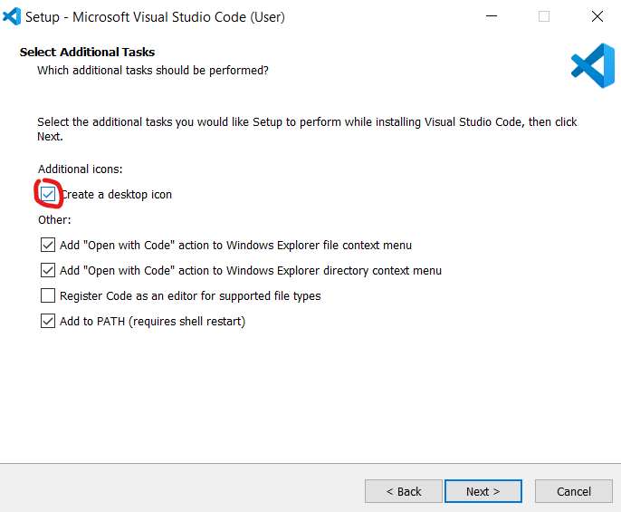
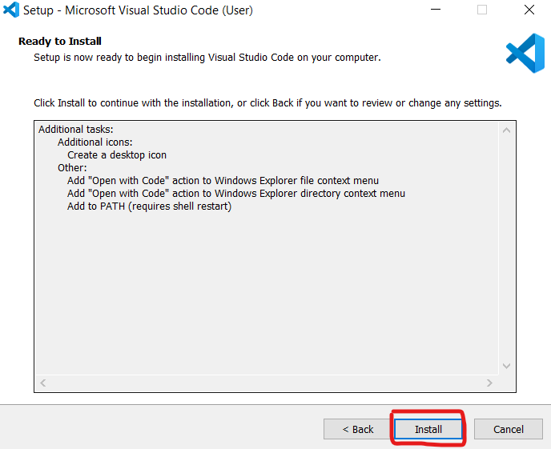
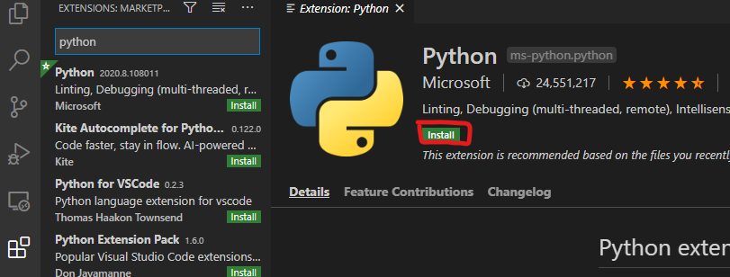
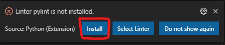

# Módulo 3 Introducción a las arquitecturas y desarrollo con API Rest - Clase 1 

## Instalación de Python, VSCODE, Venv y Flask


### Instalación de Python

Ingresamos al sitio https://www.python.org/ y le damos click a Downloads


Descargue la versión para su sistema Operativo. En el caso de Windows Python 3.8.5


Una vez termine la descarga, haga doble click en el archivo, Agregar Python 3.8 al path y luego en Instalar Ahora


Después de terminada la instalación, haga click en Deshabilitar el límite de longitud del Path


### Instalación de VSCode

Ingresamos al sitio https://www.python.org/ y le damos click a Download para el sistema operativo que estemos utilizando


Hacemos doble click en el archivo y aceptamos los términos y condiciones


En la siguiente pantalla le damos click a Crear icono en el escritorio y de nuevo siguiente



Hacemos click en Instalar



Finalmente, hacemos click en Terminar y Lanzar Visual Studio Code


Si nos sale una alerta de Firewall, hacemos click en Permitir acceso


Se recomienda instalar las extensiones de Python y Python Docstring Generator. Para hacerlo deben ir a la pestaña de extensiones, buscar Python y luego hacer click en instalar



Para instalar Python DocString, busca python doc, seleccionan la extensión y click en Instalar


### Instalación del Virtual Environment

El Virtual Environment nos permite crear grupos independientes de librerías en Python para cada proyecto. Esto resuelve posibles conflictos que se pueden presentar al trabajar diferentes versiones de una librería o del mismo Python si estás son instaladas de forma global

Creamos una carpeta, por ejemplo gestion-estudiantes, y adentro creamos la carpeta server.

Vamos a VsCode y hacemos click en Archivo - Abrir Carpeta, seleccionamos la carpeta de gestion-estudiantes y dentro de la carpeta server, creamos dos archivos:

- app.py
- requirements.txt

En caso de que VSCode nos pregunte que interprete utilizar para Python, seleccionamos la versión instalada


VsCode nos va a sugerir que utilicemos pylint para revisar nuestro código, hacemos click en Instalar



Hacemos click en Terminal y ejecutamos los siguientes comandos:

```bash
py 3 -m venv .venv
.\venv\Scripts\activate
```


Si se genera el mensaje "Activate.ps1 is not digitally signed. You cannot run this script on the current system.", entonces debe ejecutar 

```bash
Set-ExecutionPolicy -ExecutionPolicy RemoteSigned -Scope Process
source .venv/bin/activate
```


Si esta trabajando en MacOs o Linux, ejecute los siguientes comandos

```bash
python3 -m venv .venv
source .venv/bin/activate
```


### Instalación y Ejecución de Flask

En el archivo requirements.tx incluya la librería de Flask

```python
Flask==1.1.2
```

En la terminal ejecutamos el siguiente comando:

En Windows:

```bash
pip install -r requirements.txt
```

En MacOS/Linux:

```bash
pip3 install -r requirements.txt
```

En el archivo app.py importe Flask y cree una instancia de un objeto de Flask

```python
from flask import Flask
app = Flask(__name__)


if __name__ == '__main__':
    app.run(debug=True)
```
Adicione también en el archivo app.py, una función que retorne algun contenido, en este caso, un string; use, además, el decorador app.route para mapear la ruta del URL / a esa función:

```python
@app.route("/")
def hola_mundo():
  return "Hola, Mundo!"
```
Guarde la aplicación app.py (cmd/ctrl S).

En la terminal, ejecute la aplicación mediante el comando:

En Windows:
```bash
python -m flask run --reload
```

En MacOS/Linux
```bash
python3 -m flask run --reload
```

El servidor busca la aplicacción app.py por defecto. Al correr Flask, verá una salida similar a la siguiente:
```bash
(env) python -m flask run --reload
 * Environment: production
   WARNING: Do not use the development server in a production environment.
   Use a production WSGI server instead.
 * Debug mode: off
 * Running on http://127.0.0.1:5000/ (Press CTRL+C to quit)
```

Abrimos en un navegador la ruta localhost:5000, y debemos ver el mensaje Hola, Mundo!

Cambiemos algo del código

```python
from flask import Flask
app = Flask(__name__)


@app.route("/")
def hola_mundo():
  return "Adios, Mundo!"
```

Se actualizará automáticamente, y si ingresamos de nuevo a la ruta, veremos el nuevo mensaje.

Agreguemos una nueva ruta pero con un parametro. La f indica un string con formato, el nombre es reemplazado por el parámetro que recibe la función

```python
@app.route("/saludo/<nombre>")
def saludo(nombre):
  return f"Hola {nombre}"
```

Podemos indicar el tipo de dato que va a recibir la ruta de la siguiente forma

```python
@app.route("/saludo/<string:nombre>")
def saludo(nombre):
  return f"Hola {nombre}"
```

Agregemos un parámetro dentro de la query de la ruta: titulo

```python
@app.route("/saludo/<string:nombre>")
def saludo(nombre):
  titulo = request.args.get('titulo', '')
  return f"Hola {titulo} {nombre}"
```

En un navegador ingresamos la ruta incluyendo el parámetro, la respuesta que obtenemos 

```
http://localhost:5000/saludo/jaime?titulo=Sr
```


Así queda el código con estas dos rutas:

```python
from flask import Flask,request
import sys

app = Flask(__name__)

@app.route("/")
def hola_mundo():
  print("holas")
  return "Adiós, Mundo!"


@app.route("/saludo/<string:nombre>")
def saludo(nombre):
  titulo = request.args.get('titulo', '')
  return f"Hola {titulo} {nombre}"

if __name__ == '__main__':
    app.run(debug=True)
```

Ejercicio: Agreguen una nueva ruta que se llame despedida, deb recibir como parte la ruta un string el nombre de la persona y como parámetro la frase de despedida (Chao, Adiós, Sayonara). Es decir que si se ingresa a la ruta /despedida/jaime?tipo=Sayonara la respuesta que debemos obtener es Sayonara jaime


### Instalación de Postman y/o Rest Client

Vamos a utilizar un Cliente para conectarnos con las APIs que se van a crear. Se recomienda utilizar Postman y/o la extensión Rest Client de VSCode


Para instalar Postman

Vamos a crear una base de datos en un diccionario local
```python
estudiantes_db={
  "11234224":{
    "cedula":11234224,
    "nombre":"Juana",
    "apellido":"Correa",
    "correo":"juana.correa@misena.edu.co",
    "carrera":"Electrónica"
  },
  "12434236":{
    "cedula":12434236,
    "nombre":"Jaime",
    "apellido":"García",
    "correo":"jaime.garcia@misena.edu.co",
    "carrera":"Administración"
  },
  "61236224":{
    "cedula":61236224,
    "nombre":"Roberta",
    "apellido":"Mejia",
    "correo":"roberta.mejia@misena.edu.co",
    "carrera":"Sistemas"
  },
  "52433236":{
    "cedula":52433236,
    "nombre":"Miriam",
    "apellido":"Zapata",
    "correo":"miriam.zapata@misena.edu.co",
    "carrera":"Sistemas"
  }
}
```

Agregamos un Endpoint para obtener los datos de uno de los estudiantes:


```python
@app.route("/api/estudiantes/<int:id>")
def obtener_estudiante(id):
  estudiante=estudiantes_db[str(id)]
  return f"Estudiante con cédula {id} se llama {estudiante['nombre']} {estudiante['apellido']} y es de la carrera {estudiante['carrera']} "
```

Ahora creamos otra ruta para obtener la lista completa de estudiantes:

```python
@app.route("/api/estudiantes")
def obtener_estudiantes():
  print('Hello world!')  
  lista_estudiantes=[f"{estudiantes_db[key]['nombre']} {estudiantes_db[key]['apellido']}" for key in estudiantes_db.keys()]
  return f"Los estudiantes de este curso son {', '.join(lista_estudiantes)}"
```

El código que llevamos hasta el momento, es el siguiente:

```python
from flask import Flask,request
import sys

app = Flask(__name__)


estudiantes_db={
  "11234224":{
    "cedula":11234224,
    "nombre":"Juana",
    "apellido":"Correa",
    "correo":"juana.correa@misena.edu.co",
    "carrera":"Electrónica"
  },
  "12434236":{
    "cedula":12434236,
    "nombre":"Jaime",
    "apellido":"García",
    "correo":"jaime.garcia@misena.edu.co",
    "carrera":"Administración"
  },
  "61236224":{
    "cedula":61236224,
    "nombre":"Roberta",
    "apellido":"Mejia",
    "correo":"roberta.mejia@misena.edu.co",
    "carrera":"Sistemas"
  },
  "52433236":{
    "cedula":52433236,
    "nombre":"Miriam",
    "apellido":"Zapata",
    "correo":"miriam.zapata@misena.edu.co",
    "carrera":"Sistemas"
  }
}

@app.route("/api/estudiantes")
def obtener_estudiantes():
  print('Hello world!')  
  lista_estudiantes=[f"{estudiantes_db[key]['nombre']} {estudiantes_db[key]['apellido']}" for key in estudiantes_db.keys()]
  return f"Los estudiantes de este curso son {', '.join(lista_estudiantes)}"

@app.route("/api/estudiantes/<int:id>")
def obtener_estudiante(id):
  estudiante=estudiantes_db[str(id)]
  return f"Estudiante con cédula {id} se llama {estudiante['nombre']} {estudiante['apellido']} y es de la carrera {estudiante['carrera']} "


if __name__ == '__main__':
    app.run(debug=True)
```

Acabamos de construir nuestro primer REST API 🥳 

REST (Representational State Transfer) es una interfaz para conectar sistamas basados en el protocolo HTTP. 

Ventajas
- Nos permite separar el client y el servidor
- Podemos crear pequeños servicios (microservicios) orientados a una tarea
- Facilita la escalabilidad, se pueden tener varios servidores con balanceadores de carga
- REST se ha vuelto un estándar mundial, por lo que la mayoría de desarrolladores sabe trabajar con él

REST es utilizada por la mayoría de empresas de tecnología del mundo, incluyendo a Google, Netflix, Twitter, Amazon, Facebook y Microsoft

#### Buenas prácticas a la hora de diseñar una REST API

Use pronombres en plural para indicar los recursos asociados
```
estudiantes
```

El identificador a la derecha del recurso indica que se va a realizar operaciones con el Estudiante con ID 1324345

```
estudiantes/1324345
```

Si el recurso tiene asociado otro recurso, esto se puede indicar en el Endpoint de la siguiente forma:

```
estudiantes/1324345/peticiones
```

Esto indica que devuelva todas las peticiones del estudiante con ID 1324345

También se puede pedir un recurso específico asociado a otro recurso. Por ejemplo, en la siguiente ruta se estaría pidiendo la petición con ID 12 del estudiante con ID 1324345

```
estudiantes/1324345/peticiones/12
```

Utilice los query strings para propiedades no asociadas a los recurso. Por ejemplo

```
/estudiantes?ordenar=nombre
/estudiantes?pagina=1
/estudiantes?formato=json
```

Tipos de Parámetros que acepta Flask

| Tipo  | Descripción |
| ------------- | ------------- |
| string  | Acepta cualquier texto sin slash (definido por defecto). |
| int  | Admite un entero positivo |
| path  | Similar a un string, pero se adimiten slashes |
| uuid  | Admite strings UUID (Identificadores únicos) |


El verbo que acabamos de utilizar es el GET, existen otros verbos en el Protocolo HTTP, debemos usarlos siempre que sea posible:


GET
- Obtiene un recurso
POST
- Agrega un nuevo recurso 
PUT
- Actualiza un recurso existente
PATCH
- Actualiza de forma parcial un recurso existente
DELETE
- Borra un recurso existente

Si es necesario se puede utilizar otros verbos. La siguiente ruta sería para aprobar la petición 12 del estudiante 1324345

```
POST /estudiantes/1324345/peticiones/12/aprobar
```


Respuestas esperadas de cada verbo (Buenas prácticas)


| Recurso  | GET | POST | PUT | DELETE |
| ------------- | ------------- | ------------- | ------------- | ------------- |
| /estudiantes  | Obtener Lista  | Crear elemento  | Actualizar Batch  | Error |
| /estudiantes/1324345  | Obtener Elemento  | Error  | Actualizar Elemento  | Borrar Elemento |


Idempotencia: Operación que puede ser aplica múltiples veces, sin cambiar el resultado

- GET, PUT, PATCH y DELETE: Idempotentes
- POST no es idempotente


Generemos una ruta con el verbo POST para agregar un nuevo estudiante:

```python
@app.route("/estudiantes",methods=['POST'])
def agregar_estudiante():
    estudiante_id=str(request.json["cedula"])
    estudiantes_db[estudiante_id]=request.json
    return f"Estudiante con ID {estudiante_id} agregado"
```

Si hacemos el POST con Postman o Rest Client, agregamos un nuevo estudiante
```python
### Agregar nuevo estudiante
POST http://localhost:5000/estudiantes
Content-Type: application/json

{
  "cedula":2354656,
  "nombre":"Julian",
  "apellido":"Parra",
  "correo":"julian.parra@misena.edu.co",
  "carrera":"Industrial"
}
```

Ejercicio: Complete el código para las rutas con verbos PUT (actualizar toda la información del estudiante a partir de la cédula) y DELETE (eliminar el estudiante a partir de la cédula). Recuerde la función del para borrar atributos de un diccionario

```python
@app.route("/estudiantes/<int:id>",methods=['PUT'])
def actualizar_estudiante(id):

@app.route("/estudiantes/<int:id>",methods=['DELETE'])
def eliminar_estudiante(id):
```

Estas serían las consultas de Actualización y borrado

```python
@cedula2=2354656
### Actualizar estudiante
PUT http://localhost:5000/estudiantes/{{cedula2}}
Content-Type: application/json

{
    "cedula":2354656,
    "nombre":"Julian",
    "apellido":"Parras",
    "correo":"julian.parras@misena.edu.co",
    "carrera":"Electrónica"
}


### Eliminar estudiante
DELETE http://localhost:5000/estudiantes/{{cedula2}}
```

Diseñando resultados


Sea consistente (snake_case, camelCase, spinal-case)
No expongan datos de servidor
No exponga datos privados
No exponga datos que puedan generar brechas de seguridad