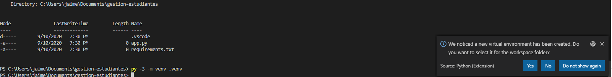
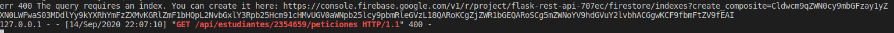
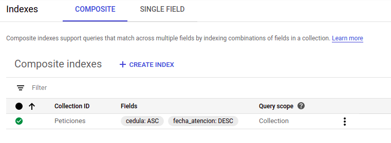

# Módulo 3 Introducción a las arquitecturas y desarrollo con API Rest 
# Clase 2 

# Tabla de Contenido

<!-- toc -->

- [Conexión a la Base de Datos Cloud FireStore](#conexión-a-la-base-de-datos-cloud-firestore)
- [Creación de Clases con Modelo de Datos](#creación-de-clases-con-modelo-de-datos)
- [Creación de Rutas para Estudiantes](#creación-de-rutas-para-estudiantes)
  - [Agregar Estudiantes](#agregar-estudiantes)
  - [Obtener Estudiantes](#obtener-estudiantes)
  - [Actualizar y Borrar Estudiantes](#actualizar-y-borrar-estudiantes)
- [Creación de Rutas para Peticiones](#creación-de-rutas-para-peticiones)
  - [Agregar Peticiones](#agregar-peticiones)
  - [Obtener Peticiones](#obtener-peticiones)
  - [Actualizar, Aprobar y Borrar Peticiones](#actualizar-aprobar-y-borrar-peticiones)


<!-- tocstop -->


## Conexión a la Base de Datos Cloud FireStore

Vamos a incluir dos librerías en nuestro requirements.txt: firebase-admin para la conexión con bases de datos y pytz para el manejo de zonas horarias

```python
Flask==1.1.2
firebase-admin==4.3.0
pytz==2020.1
```
Debemos tener activo el entorno virtual, si no lo tenemos- Hacemos click en Terminal y ejecutamos los siguientes comandos:

```bash
.venv\Scripts\activate
```



Si se genera el mensaje "Activate.ps1 is not digitally signed. You cannot run this script on the current system.", entonces debe ejecutar 

```bash
Set-ExecutionPolicy -ExecutionPolicy RemoteSigned -Scope Process
.venv\Scripts\activate 
```


Si esta trabajando en MacOs o Linux, ejecute los siguientes comandos

```bash
source .venv/bin/activate
```

Luego, en la misma terminal ejecutamos el siguiente comando:

En Windows:

```bash
pip install -r requirements.txt
```

En MacOS/Linux:

```bash
pip3 install -r requirements.txt
```


Incluimos el siguiente código para conectarnos con Cloud FireStore y generar referencias a las Colecciones Estudiantes y Peticiones
```python
from flask import Flask, request, jsonify
from firebase_admin import credentials, firestore, initialize_app


app = Flask(__name__)

# Inicializar Firestore DB
cred = credentials.Certificate('key/key.json')
default_app = initialize_app(cred)
db = firestore.client()
estudiantes_ref = db.collection('Estudiantes')
peticiones_ref = db.collection('Peticiones')

if __name__ == '__main__':
    app.run(debug=True)
```

## Creación de Clases con Modelo de Datos

Vamos a generar dos Clases para nuestro modelo de datos (Estudiante y Petición), creamos una carpeta models y los archivos estudiante.py y peticion.py

> ¿Por qué usamos clases?

Para la instancia de Peticiones debemos incluir la fecha en la zona horaria correcta, importamos pytz, datetime y asignamos la zona horaria
```python
import pytz
from datetime import datetime

timezone = pytz.timezone("America/Bogota")
```

La clase de petición sería la siguiente:
```python
import pytz
from datetime import datetime

timezone = pytz.timezone("America/Bogota")

class Peticion:
    def __init__(self, cedula, peticion, fecha_atencion,estado = "Creada"):
        self.cedula = cedula
        self.peticion = peticion
        self.fecha_atencion = timezone.localize(datetime.strptime(fecha_atencion, '%d/%m/%y %H:%M:%S'))
        self.fecha_creacion = timezone.localize(datetime.now())
        self.estado = estado


    def to_dict(self):
        return dict((key, value) for (key, value) in self.__dict__.items())
```


> **Ejercicio**: Cree el modelo de Estudiante en el archivo estudiante.py dentro de la carpeta models, debe tener los siguiente campos: cedula, nombre, apellido, correo, carrera


Ahora vamos a crear un archivo __init__.py en la carpeta models para importar los dos modelos

```python
from .estudiante import Estudiante
from .peticion import Peticion
```

Importamos los modelos en el app.py

```python
from flask import Flask, request, jsonify
from firebase_admin import credentials, firestore, initialize_app

from models import Estudiante,Peticion
```

Probemos crear una instancia de cada modelo para verificar que quedo bien
```python
nuevo_estudiante=Estudiante(122345, "Jaime", "Garcia", "jaime.garcia", "Electronica")
print(nuevo_estudiante.to_dict())
```


Ahora creamos una peticion de prueba
```python
nueva_peticion=Peticion(122345, "Asesoria",'25/09/20 7:00:00')
print(nueva_peticion.to_dict(),nueva_peticion.fecha_creacion,nueva_peticion.fecha_atencion)
```

El código completo que llevamos hasta el momento es el siguiente:


**models**

__init__.py
```python
from .estudiante import Estudiante
from .peticion import Peticion
```

estudiante.py
```python
class Estudiante:
    def __init__(self, cedula, nombre, apellido, correo, carrera):
        self.cedula = cedula
        self.nombre = nombre
        self.apellido = apellido
        self.correo = correo
        self.carrera = carrera

    def to_dict(self):
        return dict((key, value) for (key, value) in self.__dict__.items())
```

peticion.py
```python
import pytz
from datetime import datetime

timezone = pytz.timezone("America/Bogota")

class Peticion:
    def __init__(self, cedula, peticion, fecha_atencion,estado = "Creada"):
        self.cedula = cedula
        self.peticion = peticion
        self.fecha_atencion = timezone.localize(datetime.strptime(fecha_atencion, '%d/%m/%y %H:%M:%S'))
        self.fecha_creacion = timezone.localize(datetime.now())
        self.estado = estado


    def to_dict(self):
        return dict((key, value) for (key, value) in self.__dict__.items())
```

**root**

app.py
```python

from flask import Flask, request, jsonify
from firebase_admin import credentials, firestore, initialize_app

from models import Estudiante,Peticion

app = Flask(__name__)

# Inicializar Firestore DB
cred = credentials.Certificate('key/key.json')
default_app = initialize_app(cred)
db = firestore.client()
estudiantes_ref = db.collection('Estudiantes')
peticiones_ref = db.collection('Peticiones')


nuevo_estudiante=Estudiante(122345, "Jaime", "Garcia", "jaime.garcia", "Electronica")
print(nuevo_estudiante.to_dict())

nueva_peticion=Peticion(122345, "Asesoria",'25/09/20 7:00:00')
print(nueva_peticion.to_dict(),nueva_peticion.fecha_creacion,nueva_peticion.fecha_atencion)

if __name__ == '__main__':
    app.run(debug=True)
```


## Creación de Rutas para Estudiantes

### Agregar Estudiantes

Vamos a agregar la primera ruta: POST para Agregar nuevos estudiantes

```python
@app.route("/api/estudiantes",methods=['POST'])
def agregar_estudiante():

    data=request.json
    estudiante_id=str(request.json["cedula"])
    try:  
        nuevo_estudiante=Estudiante(data["cedula"], data["nombre"], data["apellido"],data["correo"], data["carrera"]).to_dict()
        estudiantes_ref.document(estudiante_id).set(nuevo_estudiante)
        return jsonify(nuevo_estudiante),201
    except:
        error_message={"error":"Los datos del estudiante no están completos o son incorrectos"}
        return jsonify(error_message),400
```

> ¿Qué pasa si volvemos a crear un estudiante con la misma cédula?

Nos falta validar si ya existe un documento con el mismo ID, en cuyo caso retornamos error
```python
@app.route("/api/estudiantes",methods=['POST'])
def agregar_estudiante():

    data=request.json
    estudiante_id=str(request.json["cedula"])
    estudiantes_doc=estudiantes_ref.document(estudiante_id)
    if(estudiantes_doc.get().exists):
        error_message={"error":f"Ya existe un estudiante registrando con el ID {estudiante_id}"}
        return jsonify(error_message),400
    try:  
        nuevo_estudiante=Estudiante(data["cedula"], data["nombre"], data["apellido"],data["correo"], data["carrera"]).to_dict()
        estudiantes_doc.set(nuevo_estudiante)
        return jsonify(nuevo_estudiante),201
    except:
        error_message={"error":"Los datos del estudiante no están completos o son incorrectos"}
        return jsonify(error_message),400
```

Si hacemos una consulta como la siguiente, se agregará un estudiante en la base de datos

```python
### Agregar nuevo estudiante
POST http://localhost:5000/api/estudiantes
Content-Type: application/json

{
  "cedula":2354659,
  "nombre":"Julian",
  "apellido":"Parras",
  "correo":"julian.parra@misena.edu.co",
  "carrera":"Industrial"
}
```

### Obtener Estudiantes

Ahora vamos a crear una ruta para obtener todos los estudiantes agregados

```python
@app.route("/api/estudiantes",methods=['GET'])
def obtener_lista_estudiantes():

    results=estudiantes_ref.stream()
    lista_estudiantes=[item.to_dict() for item in results]

    return jsonify({"data":lista_estudiantes}),200
```

Probamos con la siguiente petición en Rest Client

```python
### Listar todos los estudiantes
GET http://localhost:5000/api/estudiantes
```

Generemos una ruta para obtener un estudiante específico a partir de su cédula

```python
@app.route("/api/estudiantes/<int:id>",methods=['GET'])
def obtener_estudiante(id):

    estudiante_doc=estudiantes_ref.document(str(id)).get()
    if(estudiante_doc.exists):
      return jsonify(estudiante_doc.to_dict()),200
    else:
      error_message={"error":f"No se encontró ningún estudiante con el ID {id}"}
      return jsonify(error_message),400
```

Probamos con la siguiente petición en Rest Client

```python
### Obtener información de estudiante
GET http://localhost:5000/api/estudiantes/{{cedula}}
```


### Actualizar y Borrar Estudiantes

> Ejercicio: Crear las Rutas para Actualizar y Borrar Estudiantes con conexión a la base de datos y validación de errores

```python
@cedula2=2354659
Pruebe su código con las siguientes peticiones en REST Client o Postman

### Actualizar estudiante
PUT http://localhost:5000/api/estudiantes/{{cedula2}}
Content-Type: application/json

{
    "cedula":2354656,
    "nombre":"Julian",
    "apellido":"Parras",
    "correo":"julian.parras@misena.edu.co",
    "carrera":"Electrónica"
}


### Eliminar Estudiante
DELETE http://localhost:5000/api/estudiantes/{{cedula2}}
```

## Creación de Rutas para Peticiones

Continuamos con la ruta de peticiones. Para la Colección de Peticiones utilizaremos como identificador el generado por Firebase

> ¿Por qué no usar un ID con un Auto-incremento u otra alternativa?

### Agregar Peticiones

Primero vamos a crear el POST para Agregar peticiones relacionadas con un estudiante

```python
@app.route("/api/estudiantes/<int:id>/peticiones",methods=['POST'])
def crear_peticion(id):

    data=request.json
    estudiante_id=str(id)
    estudiante_doc=estudiantes_ref.document(estudiante_id)

    if(estudiante_doc.get().exists):
        try:  
            nueva_peticion=Peticion(data["cedula"], data["peticion"], data["fecha_atencion"]).to_dict()
            peticion_ref=peticiones_ref.add(nueva_peticion)
            nueva_peticion["id"]=peticion_ref[1].id

            return jsonify(nueva_peticion),200
        except:
            error_message={"error":"Los datos de la petición no están completos o son incorrectos"}
            return jsonify(error_message),400
    else:
        error_message={"error":f"No se encontró ningún estudiante con el ID {id}"}
        return jsonify(error_message),400
```

Probamos con la siguiente petición en Rest Client

```python
### Agregar Petición
POST http://localhost:5000/api/estudiantes/{{cedula2}}/peticiones
Content-Type: application/json

{
  "cedula":2354659,
  "peticion":"Asesoría",
  "fecha_atencion":"25/09/20 7:00:00"
}
```


### Obtener Peticiones

Ahora vamos a generar la ruta GET para obtener todas las peticiones de un estudiantes

```python
@app.route("/api/estudiantes/<int:id>/peticiones",methods=['GET'])
def obtener_peticiones(id):

    estudiante_id=str(id)
    estudiante_doc=estudiantes_ref.document(estudiante_id)

    if(estudiante_doc.get().exists):
        try:  
            query = peticiones_ref.where('cedula','==',id).order_by('fecha_atencion')
            results = query.stream()
            lista_peticiones=[to_dict_with_id(item) for item in results]
            return jsonify({"data":lista_peticiones}),200
        except Exception as err:
            error_message={"error":"Los datos de la petición no están completos o son incorrectos"}
            return jsonify(error_message),400
    else:
        error_message={"error":f"No se encontró ningún estudiante con el ID {id}"}
        return jsonify(error_message),400
```

Para generar la respuesta, vamos a crear una función que tome cada resultado, lo convierta diccionaro y le incluya el id del documento


```python
def to_dict_with_id(item):
    print(item,item.id)
    item_dict=item.to_dict()
    item_dict["id"]=item.id
    return item_dict
```


Cuando ejecutamos la consulta con la petición en Rest Client, vamos a ver que da el siguiente error

```
GET http://localhost:5000/api/estudiantes/{{cedula2}}/peticiones
Content-Type: application/json
```



Si vamos al enlace que nos genera el error, nos va a dar la posibilidad de crear un índice compuesto, hacemos click en Crear


Después de unos minutos, el índice quedará creado, si volvemos a hacer la consulta, esta vez funcionará correctamente




Este es el código completo que llevamos hasta el momento


**models**

__init__.py
```python
from .estudiante import Estudiante
from .peticion import Peticion
```

estudiante.py
```python
class Estudiante:
    def __init__(self, cedula, nombre, apellido, correo, carrera):
        self.cedula = cedula
        self.nombre = nombre
        self.apellido = apellido
        self.correo = correo
        self.carrera = carrera

    def to_dict(self):
        return dict((key, value) for (key, value) in self.__dict__.items())
```

peticion.py
```python
import pytz
from datetime import datetime

timezone = pytz.timezone("America/Bogota")

class Peticion:
    def __init__(self, cedula, peticion, fecha_atencion,estado = "Creada"):
        self.cedula = cedula
        self.peticion = peticion
        self.fecha_atencion = timezone.localize(datetime.strptime(fecha_atencion, '%d/%m/%y %H:%M:%S'))
        self.fecha_creacion = timezone.localize(datetime.now())
        self.estado = estado


    def to_dict(self):
        return dict((key, value) for (key, value) in self.__dict__.items())
```

**root**

app.py
```python
from flask import Flask, request, jsonify
from firebase_admin import credentials, firestore, initialize_app


from models import Estudiante,Peticion

def to_dict_with_id(item):
    print(item,item.id)
    item_dict=item.to_dict()
    item_dict["id"]=item.id
    return item_dict

app = Flask(__name__)

# Inicializar Firestore DB
cred = credentials.Certificate('key/key.json')
default_app = initialize_app(cred)
db = firestore.client()
estudiantes_ref = db.collection('Estudiantes')
peticiones_ref = db.collection('Peticiones')


nuevo_estudiante=Estudiante(122345, "Jaime", "Garcia", "jaime.garcia", "Electronica")
print(nuevo_estudiante.to_dict())


nueva_peticion=Peticion(122345, "Asesoria",'25/09/20 7:00:00')
print(nueva_peticion.to_dict(),nueva_peticion.fecha_creacion,nueva_peticion.fecha_atencion)


@app.route("/api/estudiantes",methods=['POST'])
def agregar_estudiante():

    data=request.json
    estudiante_id=str(request.json["cedula"])
    estudiante_doc=estudiantes_ref.document(estudiante_id)
    if(estudiante_doc.get().exists):
        error_message={"error":f"Ya existe un estudiante registrando con el ID {estudiante_id}"}
        return jsonify(error_message),400
    try:  
        nuevo_estudiante=Estudiante(data["cedula"], data["nombre"], data["apellido"],data["correo"], data["carrera"]).to_dict()
        estudiante_doc.set(nuevo_estudiante)
        return jsonify(nuevo_estudiante),201
    except:
        error_message={"error":"Los datos del estudiante no están completos o son incorrectos"}
        return jsonify(error_message),400

@app.route("/api/estudiantes",methods=['GET'])
def obtener_lista_estudiantes():

    results=estudiantes_ref.stream()
    lista_estudiantes=[item.to_dict() for item in results]

    return jsonify({"data":lista_estudiantes}),200

@app.route("/api/estudiantes/<int:id>",methods=['GET'])
def obtener_estudiante(id):

    estudiante_doc=estudiantes_ref.document(str(id)).get()
    if(estudiante_doc.exists):
      return jsonify(estudiante_doc.to_dict()),200
    else:
      error_message={"error":f"No se encontró ningún estudiante con el ID {id}"}
      return jsonify(error_message),400


@app.route("/api/estudiantes/<int:id>",methods=['PUT'])
def actualizar_estudiante(id):

    data=request.json
    estudiante_id=str(id)
    estudiante_doc=estudiantes_ref.document(estudiante_id)

    if(estudiante_doc.get().exists):
        try:  
            nuevo_estudiante=Estudiante(data["cedula"], data["nombre"], data["apellido"],data["correo"], data["carrera"]).to_dict()
            estudiantes_ref.document(estudiante_id).update(nuevo_estudiante)
            return jsonify(nuevo_estudiante),200
        except:
            error_message={"error":"Los datos del estudiante no están completos o son incorrectos"}
            return jsonify(error_message),400
    else:
        error_message={"error":f"No se encontró ningún estudiante con el ID {id}"}
        return jsonify(error_message),400


@app.route("/api/estudiantes/<int:id>",methods=['DELETE'])
def eliminar_estudiante(id):

    estudiante_id=str(id)
    estudiante_doc=estudiantes_ref.document(estudiante_id)

    if(estudiante_doc.get().exists):
        estudiante_doc.delete()
        result={"cedula":id,"borrado":True}
        return jsonify(result),200
    else:
        error_message={"error":f"No se encontró ningún estudiante con el ID {id}"}
        return jsonify(error_message),400


@app.route("/api/estudiantes/<int:id>/peticiones",methods=['POST'])
def crear_peticion(id):

    data=request.json
    estudiante_id=str(id)
    estudiante_doc=estudiantes_ref.document(estudiante_id)

    if(estudiante_doc.get().exists):
        try:  
            nueva_peticion=Peticion(data["cedula"], data["peticion"], data["fecha_atencion"]).to_dict()
            peticion_ref=peticiones_ref.add(nueva_peticion)
            nueva_peticion["id"]=peticion_ref[1].id

            return jsonify(nueva_peticion),200
        except:
            error_message={"error":"Los datos de la petición no están completos o son incorrectos"}
            return jsonify(error_message),400
    else:
        error_message={"error":f"No se encontró ningún estudiante con el ID {id}"}
        return jsonify(error_message),400


@app.route("/api/estudiantes/<int:id>/peticiones",methods=['GET'])
def obtener_peticiones(id):

    estudiante_id=str(id)
    estudiante_doc=estudiantes_ref.document(estudiante_id)

    if(estudiante_doc.get().exists):
        try:  
            query = peticiones_ref.where('cedula','==',id).order_by('fecha_atencion')
            results = query.stream()
            lista_peticiones=[to_dict_with_id(item) for item in results]
            return jsonify({"data":lista_peticiones}),200
        except Exception as err:
            error_message={"error":"Los datos de la petición no están completos o son incorrectos"}
            return jsonify(error_message),400
    else:
        error_message={"error":f"No se encontró ningún estudiante con el ID {id}"}
        return jsonify(error_message),400

```

### Actualizar, Aprobar y Borrar Peticiones

> **Ejercicio**: Realizar las rutas GET para Obtener una Petición, PATCH para Actualización del Estado, PUT para Actualizarla completamente y DELETE para borrarla

Utilice este código base
```python
@app.route("/api/estudiantes/<int:id>/peticiones/<string:pid>",methods=['GET','PATCH','PUT','DELETE'])
def procesar_peticion(id,pid):


    if(request.method=='GET'):

    elif(request.method=='PATCH'):

    elif(request.method=='PUT'):

    else:

```

Pruebe con las siguientes peticiones de Rest Client. Reemplazando el último valor por el ID de la petición de Prueba
(Intente construir las peticiones usted mismo)


```python
### Obtener Petición
GET http://localhost:5000/api/estudiantes/{{cedula2}}/peticiones/wlgEDbpHw6A1v7iqHLbN
Content-Type: application/json


### Aprobar Petición
PATCH http://localhost:5000/api/estudiantes/{{cedula2}}/peticiones/wlgEDbpHw6A1v7iqHLbN
Content-Type: application/json

{
  "estado": "Aprobada"
}

### Actualizar Petición
PUT http://localhost:5000/api/estudiantes/{{cedula2}}/peticiones/wlgEDbpHw6A1v7iqHLbN
Content-Type: application/json

{
  "cedula":2354659,
  "peticion":"Asesoría",
  "fecha_atencion":"25/09/20 15:00:00",
  "estado": "Aprobada"
}

### Borrar Petición
DELETE http://localhost:5000/api/estudiantes/{{cedula2}}/peticiones/wlgEDbpHw6A1v7iqHLbN
Content-Type: application/json
```